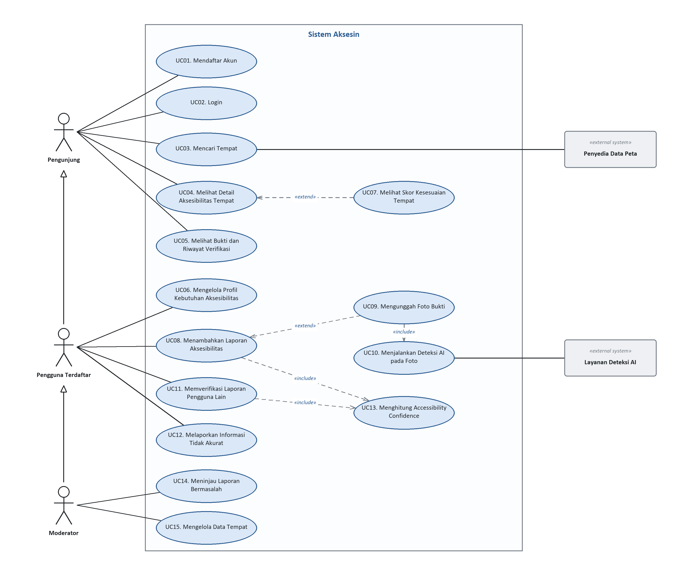
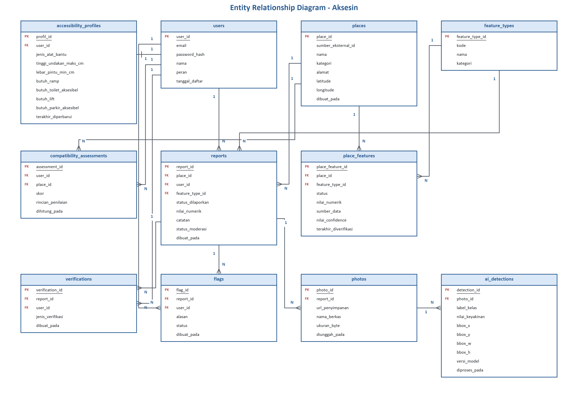
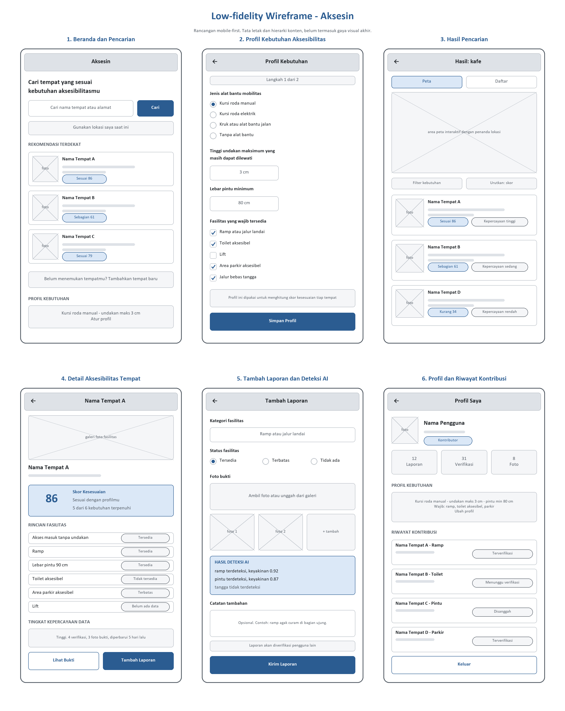

# Aksesin

**Navigate Without Barriers**

## Project Senior Project TI

Departemen Teknik Elektro dan Teknologi Informasi  
Fakultas Teknik  
Universitas Gadjah Mada

## Kelompok Aksesin (15)

| Peran | Nama | NIM |
|---|---|---|
| Ketua Kelompok | Nabil Aufa Danaputra | 24/535223/TK/59357 |
| Anggota 1 | Nayla Thalita | 24/535820/TK/59467 |
| Anggota 2 | Gilbert S. H. Nainggolan | 24/543841/TK/60447 |

## Nama Produk

**Aksesin**

Tagline: *Navigate Without Barriers*

## Jenis Produk

Aplikasi berbasis web (web application) di bidang aksesibilitas dan pemetaan lokasi, yang menggabungkan data tempat, kontribusi komunitas, komputasi awan, dan AI berbasis computer vision.

## Latar Belakang dan Permasalahan

Penyandang disabilitas, khususnya pengguna kursi roda, menghadapi berbagai hambatan ketika mengakses fasilitas umum. Informasi mengenai aksesibilitas suatu tempat, seperti keberadaan ramp, tangga, toilet aksesibel, atau jalur tanpa hambatan, sering tidak tersedia secara lengkap dan akurat.

Aplikasi peta digital yang sudah ada menyediakan sebagian informasi terkait aksesibilitas, tetapi data itu belum tentu lengkap atau sesuai kebutuhan spesifik tiap pengguna. Sebuah tempat mungkin tercatat memiliki ramp dan akses masuk untuk kursi roda, tetapi pengguna tetap tidak tahu apakah jalur menuju tempat itu punya hambatan lain, atau apakah toiletnya juga bisa dipakai.

Data aksesibilitas juga berubah seiring waktu, karena fasilitas rusak, direnovasi, atau tertutup sementara. Karena itu, dibutuhkan platform yang menampilkan informasi aksesibilitas suatu tempat, membantu pengguna menilai kesesuaian tempat itu dengan kebutuhannya, dan membuka ruang bagi masyarakat untuk memperbarui informasi tersebut.

### Rumusan Permasalahan

1. Bagaimana menyediakan informasi aksesibilitas tempat yang lebih lengkap dan mudah diakses oleh pengguna, khususnya pengguna kursi roda?
2. Bagaimana membantu pengguna menentukan apakah suatu tempat sesuai dengan kebutuhan aksesibilitas mereka, bukan hanya memberikan status umum "accessible" atau "not accessible"?
3. Bagaimana memanfaatkan AI untuk mengidentifikasi bukti fasilitas aksesibilitas, seperti ramp, tangga, dan pintu, dari foto yang diunggah pengguna?
4. Bagaimana membangun sistem berbasis komunitas yang memungkinkan informasi aksesibilitas terus diperbarui dan diverifikasi?
5. Bagaimana mengintegrasikan jaringan komputer, komputasi awan, dan AI ke dalam sistem yang bisa dikerjakan dalam satu semester?

## Ide Solusi

Aksesin adalah platform berbasis web yang membantu pengguna menemukan dan mengevaluasi aksesibilitas suatu tempat berdasarkan kebutuhan mereka.

Pada MVP, Aksesin berfokus pada pengguna kursi roda. Pengguna bisa mencari suatu tempat dan melihat informasi mengenai fasilitas seperti akses masuk, ramp, tangga, toilet, dan fasilitas lainnya.

Keunggulan utama Aksesin adalah **Compatibility Assessment**, yaitu penilaian tingkat kesesuaian suatu tempat berdasarkan kebutuhan pengguna dan data aksesibilitas yang tersedia, bukan sekadar label "accessible" atau "not accessible". Sistem menyusun penilaian ini dari kombinasi data tempat, kontribusi komunitas, dan analisis foto menggunakan AI untuk mendeteksi elemen visual yang berkaitan dengan aksesibilitas.

### Rancangan Fitur

| Nama Fitur | Keterangan |
|---|---|
| Personal Accessibility Profile | Pengguna menentukan kebutuhan aksesibilitasnya, terutama kebutuhan pengguna kursi roda, agar sistem bisa memberi rekomendasi yang lebih personal. |
| Accessibility Place Search | Pengguna mencari tempat dan melihat informasi aksesibilitas yang tersedia. |
| Compatibility Assessment | Sistem menghitung tingkat kesesuaian suatu tempat berdasarkan kebutuhan pengguna dan data fasilitas yang tersedia. |
| AI Accessibility Detection | Pengguna mengunggah foto fasilitas. AI mendeteksi elemen seperti ramp, tangga, atau pintu sebagai bukti informasi aksesibilitas. |
| Community Verification | Pengguna menambahkan, memperbarui, atau memverifikasi informasi aksesibilitas suatu tempat. |
| Accessibility Evidence | Setiap informasi didukung bukti seperti foto, laporan komunitas, dan waktu terakhir informasi diverifikasi. |
| Accessibility Confidence | Sistem menampilkan tingkat kepercayaan terhadap informasi berdasarkan sumber data, jumlah verifikasi, bukti foto, dan waktu pembaruan. |
| Accessible Route Recommendation | Rekomendasi rute yang mempertimbangkan hambatan aksesibilitas yang tercatat. Fitur ini masuk sebagai future development. |

### Ruang Lingkup MVP

Fitur yang dikerjakan pada MVP:

- Personal Accessibility Profile
- Accessibility Place Search
- Compatibility Assessment
- AI Accessibility Detection
- Community Verification
- Accessibility Confidence

Accessible Route Recommendation dijadikan future development, atau fitur tambahan apabila progres kelompok memungkinkan.

## Analisis Kompetitor

### 1. Google Maps

**Jenis Kompetitor:** Indirect Competitor

**Jenis Produk:** Platform digital untuk pencarian lokasi, navigasi, dan informasi tempat.

**Target Customer:** Masyarakat umum yang membutuhkan layanan pencarian lokasi dan navigasi.

**Kelebihan:**

- Cakupan data lokasi sangat luas.
- Fitur navigasi dan pencarian tempat.
- Sebagian informasi mengenai fasilitas aksesibilitas.
- Basis pengguna besar, sehingga data terus diperbarui.

**Kekurangan:**

- Informasi aksesibilitas belum selalu lengkap untuk setiap tempat.
- Informasi yang tersedia belum tentu sesuai kebutuhan spesifik tiap pengguna.
- Tidak berfokus pada evaluasi kesesuaian aksesibilitas.
- Bukti visual dan tingkat kepercayaan informasi aksesibilitas bukan fokus utama.

**Key Competitive Advantage dan Unique Value:**

Aksesin berfokus pada personalized accessibility assessment. Sistem membantu pengguna memahami apakah suatu tempat sesuai kebutuhan aksesibilitas mereka, didukung laporan komunitas dan bukti visual yang dianalisis AI.

### 2. Wheelmap

**Jenis Kompetitor:** Direct Competitor

**Jenis Produk:** Platform pemetaan berbasis komunitas yang menyediakan informasi aksesibilitas tempat, khususnya untuk pengguna kursi roda.

**Target Customer:** Pengguna kursi roda dan masyarakat yang membutuhkan informasi aksesibilitas suatu tempat.

**Kelebihan:**

- Fokus khusus pada aksesibilitas.
- Memanfaatkan kontribusi komunitas.
- Sistem informasi aksesibilitas yang mudah dipahami.
- Membantu pengguna menemukan tempat berdasarkan status aksesibilitas.

**Kekurangan:**

- Kelengkapan informasi bergantung pada kontribusi komunitas.
- Belum mempersonalisasi kebutuhan pengguna.
- Evaluasi kesesuaian tempat tidak mempertimbangkan profil kebutuhan pengguna secara spesifik.
- AI untuk menganalisis bukti visual aksesibilitas bukan fokus utama.

**Key Competitive Advantage dan Unique Value:**

Aksesin memperluas konsep accessibility mapping dengan personal accessibility profile, AI-based photo evidence detection, dan accessibility confidence score. Pengguna melihat kesesuaian tempat dengan kebutuhannya, lengkap dengan tingkat kepercayaan informasinya.

### 3. AccessNow

**Jenis Kompetitor:** Direct Competitor

**Jenis Produk:** Platform digital yang menyediakan informasi aksesibilitas berbagai lokasi berbasis kontribusi komunitas.

**Target Customer:** Penyandang disabilitas, pengguna dengan kebutuhan aksesibilitas tertentu, serta masyarakat umum.

**Kelebihan:**

- Fokus pada informasi aksesibilitas.
- Data dan kontribusi dari komunitas.
- Informasi mengenai fasilitas dan aksesibilitas suatu tempat.
- Mendukung kesadaran terhadap lingkungan yang inklusif.

**Kekurangan:**

- Kelengkapan data bergantung pada jumlah kontribusi komunitas di suatu wilayah.
- Informasi yang tersedia belum tentu terbaru.
- Tidak memberikan evaluasi personal berdasarkan kebutuhan pengguna.
- Pengguna masih harus menilai sendiri apakah informasi fasilitas sesuai kebutuhannya.

**Key Competitive Advantage dan Unique Value:**

Aksesin menggabungkan AI, community verification, dan personalized compatibility assessment untuk mengubah data dan bukti visual menjadi informasi yang relevan bagi kebutuhan tiap pengguna.

## Rancangan Pengembangan Produk

### Metodologi SDLC

**Agile Software Development Life Cycle dengan kerangka kerja Scrum yang disederhanakan.**

Pengembangan dibagi ke dalam sprint dua mingguan yang diselaraskan dengan jadwal pertemuan dan asistensi praktikum. Sebelum sprint pertama dijalankan, kelompok menempuh satu fase inception (Sprint 0) untuk menetapkan baseline arsitektur berupa use case diagram, entity relationship diagram, wireframe, dan kontrak antarmuka antar modul.

Alasan pemilihan metodologi:

1. Terdapat ketidakpastian teknis pada komponen AI. Akurasi model deteksi ramp, tangga, dan pintu belum dapat diketahui sebelum diuji pada data nyata, sehingga spesifikasi fitur AI Accessibility Detection baru dapat ditetapkan setelah eksperimen dilakukan.
2. Aturan penilaian perlu dikalibrasi dengan umpan balik pengguna. Ketepatan pembobotan Compatibility Assessment hanya dapat dinilai oleh pengguna kursi roda, sehingga dibutuhkan increment fungsional yang dapat diuji lebih awal.
3. Kalender akademik sudah menyediakan ritme iterasi yang alami. Dua belas pertemuan praktikum dengan asistensi berkala setara dengan sprint review.
4. Ukuran tim yang kecil menekan biaya koordinasi, sementara dokumentasi formal berlapis seperti pada Waterfall tidak sebanding dengan manfaatnya pada skala tim ini.
5. Metodologi ini selaras dengan perangkat yang diwajibkan mata kuliah, yaitu GitHub Project dan GitHub Actions, sehingga proses kerja tim dan bukti penilaian menjadi satu kesatuan.
6. Backlog yang terurut prioritas menekan risiko fitur inti tidak selesai, karena yang tersisa apabila waktu tidak mencukupi adalah item berprioritas rendah.

Modul menyebut Agile kurang cocok diterapkan pada proyek dengan dependensi yang kompleks. Pada Aksesin, dependensi antar modul dikendalikan dengan menetapkan kontrak antarmuka, yaitu skema basis data dan spesifikasi REST API, pada fase inception sebelum sprint pertama dimulai. Artefak Tahap 1 sampai 3 SDLC berperan sebagai baseline arsitektur tersebut, lalu diperlakukan sebagai living document yang hanya berubah melalui pull request yang ditinjau.

### Tujuan Produk

**Tujuan umum.** Menyediakan platform web yang memungkinkan pengguna kursi roda menilai kesesuaian sebuah tempat dengan kebutuhan aksesibilitas pribadinya sebelum berkunjung, sehingga keputusan bepergian didasarkan pada informasi yang spesifik, disertai bukti, dan diketahui tingkat kepercayaannya.

**Tujuan khusus:**

1. Menyajikan informasi aksesibilitas per fasilitas, mencakup akses masuk, ramp, tangga, lebar pintu, toilet, dan area parkir, sebagai pengganti label tunggal accessible atau not accessible.
2. Menghasilkan skor Compatibility Assessment yang dihitung dari profil kebutuhan tiap pengguna, sehingga dua pengguna dengan kebutuhan berbeda dapat memperoleh penilaian berbeda untuk tempat yang sama.
3. Memanfaatkan model computer vision untuk mendeteksi elemen aksesibilitas pada foto yang diunggah pengguna, sehingga setiap klaim data memiliki bukti visual.
4. Menyediakan mekanisme kontribusi dan verifikasi komunitas agar data tetap mutakhir ketika kondisi fisik fasilitas berubah.
5. Menampilkan Accessibility Confidence secara transparan berdasarkan sumber data, jumlah verifikasi, ada tidaknya bukti foto, dan waktu pembaruan terakhir.
6. Mengintegrasikan jaringan komputer, komputasi awan, dan AI ke dalam satu sistem yang dapat diselesaikan dan didemonstrasikan dalam satu semester.

### Pengguna Potensial dan Kebutuhannya

**1. Pengguna kursi roda (pengguna primer)**

- Mengetahui kondisi akses masuk, ramp, lebar pintu, dan ketersediaan toilet aksesibel sebelum berangkat, bukan setelah tiba di lokasi.
- Penilaian yang mempertimbangkan kondisi spesifik dirinya, misalnya kursi roda manual dan kursi roda elektrik yang berbeda lebar serta kemampuan melewati kemiringan.
- Kepastian bahwa informasi masih berlaku, karena fasilitas dapat rusak atau sedang direnovasi.
- Antarmuka yang memenuhi kaidah aksesibilitas web, mencakup navigasi papan ketik, kontras warna yang memadai, dan kompatibilitas dengan pembaca layar.

**2. Pendamping dan anggota keluarga**

- Merencanakan kunjungan serta memilih tempat yang aman bagi orang yang didampingi.
- Ringkasan cepat mengenai hambatan utama di suatu tempat tanpa harus membaca seluruh detail.
- Kemampuan membagikan informasi tempat kepada anggota keluarga atau rombongan lain.

**3. Kontributor komunitas, relawan pemetaan, dan komunitas disabilitas**

- Proses pelaporan yang singkat dan dapat diselesaikan dari ponsel ketika sedang berada di lokasi.
- Kemudahan mengunggah foto sebagai bukti tanpa harus mengisi banyak isian teknis.
- Umpan balik bahwa kontribusinya diterima, diverifikasi, dan benar-benar digunakan sistem.

**4. Moderator platform**

- Meninjau laporan yang saling bertentangan atau yang ditandai bermasalah oleh pengguna.
- Melihat hasil deteksi AI sebagai bahan pertimbangan ketika memutuskan laporan mana yang dipakai.
- Menonaktifkan laporan atau foto yang tidak relevan agar kualitas data tetap terjaga.

**5. Pengelola tempat umum (pengguna sekunder, di luar cakupan MVP)**

- Mengetahui bagaimana tempat yang dikelolanya dinilai oleh pengunjung.
- Memperbarui informasi setelah melakukan perbaikan fasilitas.

Kelompok pengguna kelima sengaja tidak dimasukkan ke dalam MVP agar cakupan tetap realistis untuk satu semester, tetapi tetap dicatat sebagai arah pengembangan lanjutan.

### Use Case Diagram

### Functional Requirements

| FR | Deskripsi |
|---|---|
| FR 1 | Sistem menyediakan fungsi pendaftaran akun menggunakan alamat surel dan kata sandi, serta memvalidasi format dan keunikan surel. (UC01) |
| FR 2 | Sistem menyediakan fungsi login dan logout, serta mempertahankan sesi pengguna yang telah terautentikasi. (UC02) |
| FR 3 | Sistem memungkinkan pengguna mencari tempat berdasarkan kata kunci nama atau alamat. (UC03) |
| FR 4 | Sistem menampilkan hasil pencarian dalam bentuk daftar sekaligus penanda pada peta interaktif. (UC03) |
| FR 5 | Sistem mengambil data tempat dari penyedia data peta eksternal dan menyimpannya ke basis data lokal ketika tempat tersebut diakses untuk pertama kali. (UC03) |
| FR 6 | Sistem menampilkan halaman detail tempat yang memuat status setiap kategori fasilitas aksesibilitas, yaitu akses masuk, ramp, tangga, lebar pintu, toilet, dan area parkir. (UC04) |
| FR 7 | Sistem menampilkan status setiap fasilitas dalam empat nilai, yaitu tersedia, terbatas, tidak tersedia, dan belum ada data. (UC04) |
| FR 8 | Sistem menampilkan bukti pendukung setiap fasilitas berupa foto, sumber data, jumlah verifikasi, dan waktu verifikasi terakhir. (UC05) |
| FR 9 | Sistem memungkinkan pengguna terdaftar mengisi dan memperbarui profil kebutuhan aksesibilitas yang mencakup jenis alat bantu mobilitas, tinggi undakan maksimum yang dapat dilewati, lebar pintu minimum, serta kebutuhan ramp, toilet aksesibel, lift, dan area parkir aksesibel. (UC06) |
| FR 10 | Sistem menghitung skor kesesuaian tempat terhadap profil kebutuhan pengguna dan menampilkannya dalam rentang 0 sampai 100 beserta kategori kesesuaiannya. (UC07) |
| FR 11 | Sistem menampilkan rincian perhitungan skor kesesuaian, yaitu kebutuhan yang terpenuhi, yang tidak terpenuhi, dan yang belum diketahui datanya. (UC07) |
| FR 12 | Sistem hanya menampilkan skor kesesuaian bagi pengguna yang telah login dan telah mengisi profil kebutuhan aksesibilitas. (UC07) |
| FR 13 | Sistem memungkinkan pengguna terdaftar menambahkan atau memperbarui laporan status fasilitas aksesibilitas pada suatu tempat. (UC08) |
| FR 14 | Sistem memungkinkan pengguna melampirkan satu atau lebih foto bukti pada laporan dan menyimpannya pada layanan penyimpanan objek. (UC09) |
| FR 15 | Sistem memvalidasi berkas foto yang diunggah berdasarkan format dan ukuran maksimum sebelum berkas diproses lebih lanjut. (UC09) |
| FR 16 | Sistem menjalankan model deteksi computer vision terhadap setiap foto yang diunggah untuk mengenali elemen ramp, tangga, pintu, dan toilet aksesibel. (UC10) |
| FR 17 | Sistem menyimpan hasil deteksi berupa label kelas, nilai keyakinan model, dan koordinat kotak pembatas, lalu menampilkannya sebagai bukti pendukung laporan. (UC10) |
| FR 18 | Sistem menandai laporan yang hasil deteksi AI-nya bertentangan dengan status yang dilaporkan pengguna agar ditinjau oleh moderator. (UC10, UC14) |
| FR 19 | Sistem memungkinkan pengguna terdaftar memverifikasi laporan pengguna lain dengan pilihan menyetujui atau menyanggah. (UC11) |
| FR 20 | Sistem memungkinkan pengguna melaporkan informasi yang dinilai tidak akurat disertai alasan pelaporan. (UC12) |
| FR 21 | Sistem menghitung nilai Accessibility Confidence setiap fasilitas berdasarkan sumber data, jumlah verifikasi yang menyetujui dan menyanggah, ada tidaknya bukti foto, dan selisih waktu sejak pembaruan terakhir. (UC13) |
| FR 22 | Sistem menghitung ulang nilai Accessibility Confidence secara otomatis setiap kali laporan atau verifikasi baru diterima. (UC13) |
| FR 23 | Sistem menurunkan nilai Accessibility Confidence secara bertahap apabila data suatu fasilitas tidak diperbarui melewati ambang waktu yang ditetapkan. (UC13) |
| FR 24 | Sistem menyediakan halaman moderasi bagi moderator untuk meninjau, menyetujui, atau menolak laporan yang ditandai bermasalah. (UC14) |
| FR 25 | Sistem memungkinkan moderator menyunting atau menonaktifkan data tempat dan laporan yang tidak sesuai. (UC15) |
| FR 26 | Sistem menyediakan navigasi penuh melalui papan ketik serta teks alternatif pada seluruh gambar dan ikon pada halaman utama, agar dapat digunakan bersama pembaca layar. (UC01 sampai UC15) |

### Entity Relationship Diagram

### Low-fidelity Wireframe

### Gantt Chart Pengerjaan Proyek

| Kegiatan | 1 | 2 | 3 | 4 | 5 | 6 | 7 | 8 | 9 | 10 | 11 | 12 |
|---|---|---|---|---|---|---|---|---|---|---|---|---|
| Perencanaan dan analisis kebutuhan | X | X |  |  |  |  |  |  |  |  |  |  |
| Perancangan sistem: use case, ERD, dan wireframe |  | X | X |  |  |  |  |  |  |  |  |  |
| Penyiapan repositori, GitHub Project, dan GitHub Actions |  | X | X |  |  |  |  |  |  |  |  |  |
| Konfigurasi lingkungan cloud dan basis data |  |  | X | X |  |  |  |  |  |  |  |  |
| Sprint 1: autentikasi dan profil kebutuhan aksesibilitas |  |  |  | X | X |  |  |  |  |  |  |  |
| Sprint 2: pencarian tempat dan integrasi peta |  |  |  |  | X | X |  |  |  |  |  |  |
| Pengumpulan dan anotasi dataset foto aksesibilitas |  |  | X | X | X | X |  |  |  |  |  |  |
| Pelatihan dan evaluasi model deteksi AI |  |  |  |  |  | X | X | X |  |  |  |  |
| Sprint 3: modul kontribusi dan verifikasi komunitas |  |  |  |  |  |  | X | X |  |  |  |  |
| Sprint 4: integrasi model AI ke alur unggah foto |  |  |  |  |  |  |  | X | X |  |  |  |
| Sprint 5: compatibility assessment dan accessibility confidence |  |  |  |  |  |  |  |  | X | X |  |  |
| Pengujian unit, integrasi, dan pengujian dengan pengguna |  |  |  |  |  |  |  |  |  | X | X |  |
| Perbaikan bug dan audit aksesibilitas antarmuka |  |  |  |  |  |  |  |  |  |  | X | X |
| Deployment final dan penyusunan dokumentasi |  |  |  |  |  |  |  |  |  |  | X | X |
| Persiapan dan presentasi akhir |  |  |  |  |  |  |  |  |  |  |  | X |
