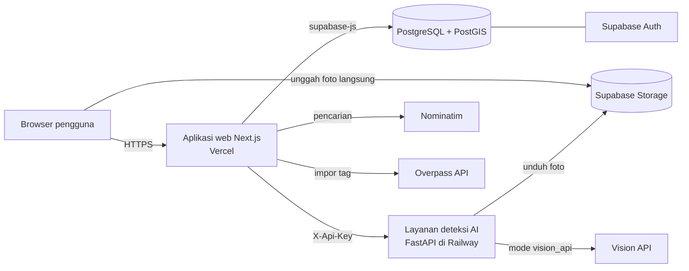

# Arsitektur Sistem

Dokumen ini menjelaskan bagian-bagian sistem Aksesin, cara bagian tersebut berkomunikasi, dan tempat setiap kode disimpan. Dokumen lain merujuk ke istilah yang didefinisikan di sini.

## Gambaran umum

Aksesin terdiri atas tiga bagian yang di-deploy terpisah:

| Bagian | Teknologi | Tanggung jawab | Hosting |
|---|---|---|---|
| Aplikasi web | Next.js, TypeScript, Tailwind CSS | Antarmuka pengguna, API internal, perhitungan skor kesesuaian | Vercel |
| Supabase | PostgreSQL dengan PostGIS, Auth, Storage | Penyimpanan data, autentikasi, hak akses baris, foto, perhitungan confidence | Supabase Cloud, region Singapura |
| Layanan deteksi AI | FastAPI, PyTorch | Mendeteksi elemen aksesibilitas pada foto | Railway |

Layanan pihak ketiga yang dipakai:

| Layanan | Kegunaan | Batasan yang wajib dipatuhi |
|---|---|---|
| Nominatim | Mencari tempat berdasarkan nama atau alamat | Maksimal 1 permintaan per detik, wajib mengirim header `User-Agent` yang mengidentifikasi aplikasi, hasil wajib disimpan agar tidak dicari berulang |
| Overpass API | Mengambil tag aksesibilitas OpenStreetMap suatu tempat | Dipanggil hanya saat tempat diimpor pertama kali, bukan setiap kali halaman dibuka |
| Tile OpenStreetMap | Peta di halaman pencarian | Wajib menampilkan atribusi "© OpenStreetMap contributors" |
| Vision API | Detektor awal sebelum model sendiri siap, lalu menjadi pembanding | Penyedia ditentukan di issue kerangka layanan AI, kunci API hanya disimpan di layanan AI |

## Diagram komponen



Browser tidak pernah memanggil layanan AI, Nominatim, atau Overpass secara langsung. Semua lewat API internal aplikasi web, sehingga kunci API tidak pernah sampai ke browser dan batas permintaan dapat dikendalikan di satu tempat.

## Alur data utama

### 1. Mencari dan membuka tempat

1. Pengguna mengetik kata kunci. Browser memanggil `GET /api/tempat/cari`.
2. Server mencari lebih dulu di tabel `places` memakai kecocokan nama dan jarak geografis.
3. Jika hasil lokal kurang dari lima, server melengkapi dengan hasil Nominatim. Hasil Nominatim yang belum ada di basis data ditandai `sudahDiimpor: false`.
4. Saat pengguna membuka tempat yang belum diimpor, browser memanggil `POST /api/tempat/impor`. Server mengambil tag tempat itu dari Overpass, lalu menyimpan baris baru di `places` dan `place_features` dengan `sumber_data = 'osm'`.
5. Halaman detail memanggil `GET /api/tempat/{id}` dan, jika pengguna sudah login dan punya profil, `GET /api/tempat/{id}/kesesuaian`.

### 2. Mengirim laporan dengan foto

1. Browser mengunggah foto langsung ke bucket `foto-laporan` di path `{user_id}/{uuid}.{ext}`. Aturan bucket menolak file di luar format dan ukuran yang diizinkan.
2. Browser memanggil `POST /api/laporan` dengan data laporan dan daftar path foto.
3. Server menyimpan baris `reports` dan `photos`.
4. Server memanggil `POST /deteksi` di layanan AI untuk setiap foto, lalu menyimpan hasilnya ke `ai_detections`.
5. Trigger basis data menghitung ulang status agregat dan confidence di `place_features`, lalu menandai laporan `perlu_tinjau` jika hasil deteksi bertentangan dengan status yang dilaporkan.
6. Jika layanan AI gagal atau melewati batas waktu 20 detik, laporan tetap tersimpan tanpa hasil deteksi. Laporan itu dapat dideteksi ulang lewat `POST /api/laporan/{id}/deteksi-ulang`.

### 3. Menghitung skor kesesuaian

1. Server mengambil profil kebutuhan pengguna dan seluruh `place_features` tempat tersebut.
2. Fungsi murni di `web/src/lib/penilaian/` menghitung skor, kategori, dan rinciannya sesuai [Algoritma Penilaian](05-algoritma-penilaian.md).
3. Hasil disimpan ke `compatibility_assessments` sebagai cache, lalu dikirim ke browser.

Skor kesesuaian dihitung di aplikasi web karena bergantung pada profil pengguna yang sedang membuka halaman. Confidence dihitung di basis data karena harus selalu konsisten setiap kali ada laporan atau verifikasi baru, dari mana pun datangnya perubahan.

### 4. Beralih dari vision API ke model sendiri

Layanan AI memiliki satu antarmuka `POST /deteksi` dengan beberapa implementasi detektor yang dapat dipertukarkan. Variabel `MODE_DETEKSI` menentukan detektor yang aktif. Saat model sendiri siap di Sprint 2, cukup ubah variabel itu di Railway. Aplikasi web tidak perlu diubah sama sekali.

## Struktur repositori

```
aksesin/
├── .github/workflows/main.yml
├── docs/
│   ├── _config.yml
│   ├── index.md
│   ├── assets/
│   └── plans/
├── supabase/
│   ├── config.toml
│   ├── migrations/
│   └── seed.sql
├── web/
│   ├── package.json
│   ├── package-lock.json
│   ├── .env.example
│   └── src/
│       ├── app/
│       │   ├── (halaman)/
│       │   └── api/
│       ├── components/
│       │   ├── ui/
│       │   └── tempat/
│       ├── lib/
│       │   ├── supabase/
│       │   ├── penilaian/
│       │   └── osm/
│       └── types/
└── ai-service/
    ├── requirements.txt
    ├── Dockerfile
    ├── .env.example
    ├── app/
    │   ├── main.py
    │   ├── konfigurasi.py
    │   ├── skema.py
    │   └── detektor/
    │       ├── dasar.py
    │       ├── vision_api.py
    │       └── yolo.py
    ├── pelatihan/
    │   ├── data.yaml
    │   └── latih.py
    └── tests/
```

Aturan struktur:

- Nama folder `web/` dan `ai-service/` tidak boleh diubah, karena workflow CI mendeteksi keberadaan kedua folder itu dengan nama tersebut.
- Frontend memakai **npm**, bukan pnpm atau yarn, karena CI membutuhkan `web/package-lock.json`.
- `ai-service/tests/` harus berisi minimal satu pengujian sejak folder dibuat. `pytest` mengembalikan kode keluar 5 jika tidak menemukan pengujian, dan itu membuat CI gagal.
- Migrasi basis data disimpan di `supabase/migrations/`, bukan dijalankan manual lewat dashboard, supaya skema selalu dapat dibuat ulang.
- Dataset foto dan bobot model **tidak** disimpan di repositori. Lihat [Pipeline AI](08-pipeline-ai.md).

## Variabel lingkungan

Nilai asli tidak pernah di-commit. Setiap folder menyediakan `.env.example` berisi nama variabel tanpa nilai rahasia. Nilai asli dibagikan antaranggota lewat jalur pribadi dan diisi di dashboard Vercel serta Railway.

### Aplikasi web (`web/.env.local`)

| Variabel | Dipakai di | Keterangan |
|---|---|---|
| `NEXT_PUBLIC_SUPABASE_URL` | Browser dan server | URL proyek Supabase |
| `NEXT_PUBLIC_SUPABASE_ANON_KEY` | Browser dan server | Kunci publik, dibatasi aturan hak akses baris |
| `SUPABASE_SERVICE_ROLE_KEY` | Server saja | Melewati hak akses baris. Tidak boleh diawali `NEXT_PUBLIC_` |
| `AI_SERVICE_URL` | Server saja | URL layanan deteksi AI |
| `AI_SERVICE_API_KEY` | Server saja | Nilai harus sama dengan `API_KEY` di layanan AI |
| `NOMINATIM_USER_AGENT` | Server saja | Contoh `Aksesin/0.1 (kontak kelompok)` |

### Layanan AI (`ai-service/.env`)

| Variabel | Keterangan |
|---|---|
| `API_KEY` | Kunci yang wajib dikirim aplikasi web lewat header `X-Api-Key` |
| `MODE_DETEKSI` | `sementara`, `vision_api`, atau `yolo`. Nilai `sementara` memakai detektor kosong yang dipakai sebelum detektor sungguhan tersedia |
| `VISION_API_KEY` | Kunci penyedia vision API |
| `VISION_API_MODEL` | Nama model vision yang dipakai |
| `MODEL_URL` | URL unduhan bobot model YOLO, dipakai saat `MODE_DETEKSI=yolo` |
| `AMBANG_KEYAKINAN` | Batas bawah keyakinan deteksi yang dikembalikan, bawaan `0.5` |

## Lingkungan deployment

| Lingkungan | Pemicu | Aplikasi web | Layanan AI | Basis data |
|---|---|---|---|---|
| Lokal | Anggota menjalankan sendiri | `npm run dev` | `uvicorn app.main:app --reload` | Proyek Supabase bersama |
| Pratinjau | Setiap pull request | URL pratinjau Vercel otomatis | Layanan produksi | Proyek Supabase bersama |
| Produksi | Merge ke `main` | Vercel produksi | Railway, deploy otomatis dari `main` | Proyek Supabase bersama |

Satu proyek Supabase dipakai bersama untuk semua lingkungan supaya kuota gratis cukup. Konsekuensinya, data uji coba harus diberi penanda yang jelas, misalnya nama tempat diawali `[UJI]`, dan dibersihkan sebelum demo.
