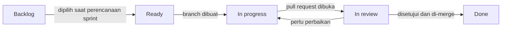

# Konvensi Kerja

Dokumen ini mengatur cara tim bekerja bersama: dari mengambil issue sampai kode masuk ke `main`. Tujuannya supaya riwayat Git rapi, kontribusi setiap anggota terlihat jelas, dan `main` selalu dalam kondisi bisa di-deploy.

## Siklus sebuah issue



| Status | Kapan kartu dipindahkan | Siapa yang memindahkan |
|---|---|---|
| Backlog | Issue belum dijadwalkan | Nabil |
| Ready | Issue masuk sprint berjalan dan dependensinya sudah selesai | Nabil saat perencanaan sprint |
| In progress | Pemilik issue mulai mengerjakan dan membuat branch | Pemilik issue |
| In review | Pull request dibuka dan CI sedang berjalan atau sudah hijau | Pemilik issue |
| Done | Pull request di-merge. Issue tertutup otomatis lewat `Closes #nomor` | Otomatis |

Aturan tambahan:

- Satu anggota maksimal memegang dua issue berstatus In progress sekaligus.
- Issue yang tertahan lebih dari tiga hari karena menunggu pekerjaan lain diberi komentar yang menyebut issue penghambatnya.

## Branch

Format nama branch:

```
<jenis>/<nomor-issue>-<ringkasan-singkat>
```

| Jenis | Dipakai untuk | Contoh |
|---|---|---|
| `fitur` | Fitur atau halaman baru | `fitur/13-autentikasi` |
| `perbaikan` | Memperbaiki perilaku yang salah | `perbaikan/29-skor-pintu-sempit` |
| `infra` | Konfigurasi, CI, deployment, migrasi | `infra/11-skema-supabase` |
| `dokumen` | Perubahan dokumen saja | `dokumen/perbarui-kontrak-api` |

Aturan:

- Branch selalu dibuat dari `main` terbaru.
- Satu branch untuk satu issue. Jika pekerjaan ternyata terlalu besar, pecah issue-nya dulu.
- Branch lama dengan nama NIU dari Lab 2.1 dibiarkan dan tidak dipakai untuk pengembangan.

## Commit

Format pesan commit mengikuti riwayat yang sudah ada di repositori:

- Bahasa Indonesia.
- Diawali kata kerja berimbuhan: `Menambahkan`, `Memperbaiki`, `Mengubah`, `Menghapus`, `Memindahkan`.
- Maksimal 72 karakter, tanpa titik di akhir.
- Satu commit untuk satu perubahan yang utuh. Hindari commit berisi campuran fitur dan perbaikan yang tidak berhubungan.
- Pesan hanya berisi deskripsi perubahan, tanpa baris trailer tambahan.
- Author commit harus identitas Git milik anggota yang mengerjakan. Periksa dengan `git config user.name` dan `git config user.email` sebelum commit pertama.

Contoh yang baik:

```
Menambahkan formulir profil kebutuhan aksesibilitas
Memperbaiki perhitungan skor saat lebar pintu belum diketahui
Mengubah batas ukuran foto laporan menjadi 5 MB
```

Contoh yang harus dihindari:

```
update
fix bug
wip
Menambahkan banyak hal
```

## Pull request

### Membuka pull request

- Judul mengikuti format pesan commit.
- Deskripsi memakai templat berikut:

```markdown
## Ringkasan
Penjelasan singkat perubahan dan alasannya.

## Issue
Closes #nomor

## Cara menguji
1. Langkah yang bisa diikuti reviewer untuk memastikan perubahan bekerja.

## Tangkapan layar
Wajib untuk perubahan antarmuka.
```

- Pull request dibuka sebagai draft jika belum siap direview, supaya tetap mendapat URL pratinjau Vercel.

### Review

- Minimal satu persetujuan dari anggota lain. Pemilik issue tidak boleh menyetujui pull request miliknya sendiri.
- Reviewer utama per jenis pekerjaan:

| Jenis perubahan | Reviewer utama |
|---|---|
| Antarmuka dan halaman | Nayla, atau Gilbert jika Nayla pemiliknya |
| Logika aplikasi, API, basis data | Gilbert, atau Nayla jika Gilbert pemiliknya |
| Layanan AI dan pipeline pelatihan | Nabil, atau Gilbert jika Nabil pemiliknya |
| Konfigurasi deployment | Nayla, atau Nabil jika Nayla pemiliknya |

- Review diberikan paling lambat satu hari kerja setelah pull request dibuka.
- Komentar review yang bersifat saran diawali `Saran:`. Komentar tanpa awalan itu wajib ditangani sebelum merge.

### Merge

- Syarat merge: seluruh job CI hijau, minimal satu persetujuan, tidak ada konflik dengan `main`.
- Metode merge: **Create a merge commit**. Jangan memakai squash atau rebase, karena riwayat commit setiap anggota harus tetap terlihat.
- Branch dihapus setelah merge.

### Proteksi branch `main`

Pengaturan di Settings, Branches, untuk `main`:

- Require a pull request before merging, dengan 1 approval.
- Require status checks to pass: `Validasi dokumen dan aset GitHub Page`, `Lint dan build frontend Next.js`, `Lint dan uji layanan deteksi AI`.
- Require branches to be up to date before merging.
- Allow merge commits aktif. Squash dan rebase dinonaktifkan.

## Definisi selesai

Sebuah issue baru boleh ditutup jika seluruh poin berikut terpenuhi:

- [ ] Semua kriteria penerimaan di dokumen modul terpenuhi.
- [ ] CI hijau.
- [ ] Sudah direview dan disetujui anggota lain.
- [ ] Perubahan antarmuka sudah dicoba di layar selebar 360 px dan 1280 px.
- [ ] Perubahan antarmuka dapat dioperasikan penuh memakai keyboard.
- [ ] Perubahan skema basis data tersimpan sebagai file migrasi.
- [ ] Variabel lingkungan baru ditambahkan ke `.env.example`.
- [ ] Dokumen di `docs/plans/` diperbarui jika perilaku atau kontraknya berubah.

## Gaya kode

### Penamaan

Istilah domain memakai bahasa Indonesia mengikuti ERD, supaya nama di kode, basis data, dan dokumen selalu sama. Istilah teknis bawaan framework tetap dalam bahasa aslinya.

| Tempat | Gaya | Contoh |
|---|---|---|
| Tabel dan kolom SQL | `snake_case` | `tinggi_undakan_maks_cm` |
| Variabel dan fungsi TypeScript | `camelCase` | `hitungSkorKesesuaian` |
| Tipe dan komponen React | `PascalCase` | `KartuSkorKesesuaian` |
| File komponen React | `PascalCase.tsx` | `KartuSkorKesesuaian.tsx` |
| File non-komponen TypeScript | `kebab-case.ts` | `skor-kesesuaian.ts` |
| Route API dan halaman | `kebab-case` | `/api/tempat/[id]/kesesuaian` |
| Variabel dan fungsi Python | `snake_case` | `muat_detektor` |
| Kelas Python | `PascalCase` | `DetektorYolo` |

Konversi dari `snake_case` basis data ke `camelCase` TypeScript dilakukan di satu tempat, yaitu lapisan akses data di `web/src/lib/supabase/`.

### Komentar

- Kode tidak memakai komentar untuk menjelaskan apa yang dilakukan kode. Jika sebuah bagian terasa perlu dijelaskan, perbaiki dulu penamaannya atau pecah menjadi fungsi dengan nama yang jelas.
- Komentar hanya dipakai untuk hal yang tidak mungkin terbaca dari kode, misalnya alasan sebuah angka ambang, batasan dari library, atau workaround untuk bug tertentu beserta tautannya.
- Tidak ada docstring atau JSDoc templat, komentar pembatas bagian, maupun kode yang dinonaktifkan dengan komentar.
- `TODO` hanya boleh disertai nomor issue, contoh `TODO(#22)`.

### Format dan lint

| Bagian | Alat | Dijalankan |
|---|---|---|
| `web/` | ESLint bawaan Next.js dan Prettier | `npm run lint`, juga di CI |
| `ai-service/` | Ruff untuk lint dan format | `ruff check .` dan `ruff format .`, lint juga di CI |

### Hal umum

- Tulis kode sesederhana mungkin untuk kebutuhan saat ini. Jangan membuat abstraksi untuk kebutuhan yang belum ada.
- Penanganan galat hanya di batas sistem: masukan pengguna, panggilan jaringan, dan respons layanan luar. Jangan membungkus setiap baris dengan `try`.
- Jangan menambah dependensi baru tanpa menyebutkannya di deskripsi pull request beserta alasannya.

## File yang tidak boleh di-commit

- `.env`, `.env.local`, dan file berisi rahasia lain.
- `node_modules/`, `.next/`, `.venv/`, `__pycache__/`.
- Bobot model (`*.pt`, `*.onnx`) dan dataset foto.
- File konfigurasi editor atau tools pribadi. Gunakan `.git/info/exclude` di clone masing-masing untuk file lokal yang tidak relevan bagi anggota lain, bukan `.gitignore`.

Sebelum commit, selalu periksa `git status` dan pastikan hanya file yang memang dimaksud yang ikut.

## Ritme sprint

| Kegiatan | Waktu | Isi |
|---|---|---|
| Perencanaan sprint | Senin pertama sprint | Memindahkan issue sprint ke Ready, memastikan dependensi jelas |
| Sinkronisasi | Setiap Senin dan Kamis, 15 menit | Apa yang selesai, apa yang dikerjakan berikutnya, apa yang menghambat |
| Review sprint | Minggu terakhir sprint | Demo hasil sprint dari URL produksi |
| Retrospektif | Setelah review sprint | Satu hal yang dipertahankan, satu hal yang diperbaiki |
