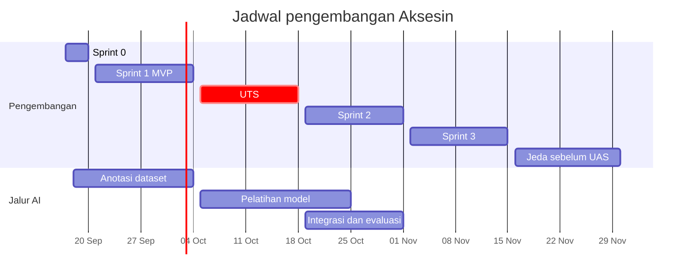

# Rencana Sprint

Dokumen ini membagi seluruh issue ke dalam sprint beserta pemilik, prioritas, dan dependensinya. Dokumen ini menjadi acuan jadwal kerja dan menggantikan Gantt chart Lab 2.4 yang disusun dengan asumsi 12 pertemuan. Jadwal dipercepat supaya pengembangan selesai jauh sebelum UAS.

## Jadwal

| Fase | Tanggal | Tujuan |
|---|---|---|
| Sprint 0 | Kamis 17 Sep sampai Minggu 20 Sep 2026 | Fondasi: basis data, kerangka proyek, panduan visual |
| Sprint 1 | Senin 21 Sep sampai Minggu 4 Okt 2026 | **MVP utuh** dengan deteksi via vision API |
| UTS | Senin 5 Okt sampai Minggu 18 Okt 2026 | Tidak ada pekerjaan inti. Pelatihan model berjalan di latar |
| Sprint 2 | Senin 19 Okt sampai Minggu 1 Nov 2026 | Model AI sendiri, moderasi, pengujian |
| Sprint 3 | Senin 2 Nov sampai Minggu 15 Nov 2026 | Perbaikan hasil pengujian, rilis final, dokumentasi |
| Jeda | Senin 16 Nov 2026 sampai UAS Desember | Tidak ada pekerjaan terjadwal |

## Prioritas

| Prioritas | Arti |
|---|---|
| **Inti** | Wajib selesai di sprint tersebut. Jika terancam terlambat, dibahas di sinkronisasi terdekat dan anggota lain membantu |
| **Geser** | Dikerjakan jika inti sudah aman. Boleh pindah ke sprint berikutnya tanpa mengganggu issue lain |

## Issue tambahan

Empat pekerjaan berikut belum ada di breakdown worksheet dan ditambahkan ke papan proyek pada 17 September 2026.

| Issue | Judul | Pemilik | Label | Milestone |
|---|---|---|---|---|
| #38 | Menyiapkan kerangka proyek web | Gilbert | `infrastruktur` | Sprint 0 |
| #39 | Menyiapkan kerangka layanan deteksi AI | Nabil | `ai` | Sprint 0 |
| #40 | Mengimplementasikan detektor berbasis vision API | Nabil | `ai` | Sprint 1 |
| #41 | Menyiapkan data tempat awal untuk demo | Nabil | `pencarian` | Sprint 1 |

## Sprint 0: Fondasi

17 sampai 20 September 2026.

| Issue | Judul | Pemilik | Prioritas | Bergantung pada | Acuan |
|---|---|---|---|---|---|
| #11 | Membuat proyek Supabase dan menerapkan skema basis data | Nayla, direview Gilbert | Inti | - | [03](03-skema-basis-data.md) |
| #38 | Menyiapkan kerangka proyek web | Gilbert | Inti | - | [01](01-arsitektur.md), bawah |
| #39 | Menyiapkan kerangka layanan deteksi AI | Nabil | Inti | - | [08](08-pipeline-ai.md) |
| #8 | Menyusun panduan visual dan komponen antarmuka | Nayla | Inti | - | [07](07-panduan-antarmuka.md) |
| #24 | Mengumpulkan dan menganotasi dataset foto | Nabil | Inti, berlanjut sampai akhir Sprint 1 sehingga milestone-nya Sprint 1 | - | [08](08-pipeline-ai.md) |

Tugas project manager di Sprint 0, tanpa issue:

- [x] Membuat issue #38 sampai #41.
- [x] Membuat milestone `Sprint 0` sampai `Sprint 3` dengan tanggal selesai sesuai jadwal, lalu memasang milestone ke setiap issue.
- [x] Mengaktifkan proteksi branch `main` sesuai [Konvensi Kerja](02-konvensi-kerja.md#proteksi-branch-main).
- [ ] Menetapkan akun ketiga anggota sebagai moderator setelah #11 selesai, untuk keperluan pengujian.

## Sprint 1: MVP

21 September sampai 4 Oktober 2026.

### Minggu pertama, 21 sampai 27 September

| Issue | Judul | Pemilik | Prioritas | Bergantung pada | Acuan |
|---|---|---|---|---|---|
| #12 | Menyiapkan deployment otomatis frontend dan layanan AI | Nayla | Inti | #38, #39 | [01](01-arsitektur.md) |
| #13 | Mengimplementasikan pendaftaran, login, dan logout | Gilbert | Inti | #38, #11 | [04](04-kontrak-api.md), [07](07-panduan-antarmuka.md) |
| #15 | Menerapkan pembedaan hak akses antar peran | Gilbert | Inti | #11 | [03](03-skema-basis-data.md) |
| #16 | Mengintegrasikan sumber data tempat dari OpenStreetMap | Gilbert | Inti | #38, #11 | [04](04-kontrak-api.md) |
| #14 | Membuat formulir profil kebutuhan aksesibilitas | Nayla | Inti | #13 | [04](04-kontrak-api.md), [07](07-panduan-antarmuka.md) |
| #17 | Membangun halaman pencarian beserta peta interaktif | Nayla | Inti | #8. Kontrak #16 cukup untuk mulai | [04](04-kontrak-api.md), [07](07-panduan-antarmuka.md) |
| #40 | Mengimplementasikan detektor berbasis vision API | Nabil | Inti | #39 | [04](04-kontrak-api.md), [08](08-pipeline-ai.md) |

### Minggu kedua, 28 September sampai 4 Oktober

| Issue | Judul | Pemilik | Prioritas | Bergantung pada | Acuan |
|---|---|---|---|---|---|
| #19 | Membangun halaman detail aksesibilitas tempat | Nayla | Inti | #16 | [04](04-kontrak-api.md), [07](07-panduan-antarmuka.md) |
| #20 | Membuat formulir laporan fasilitas beserta unggah foto | Nayla | Inti | #11, #13 | [04](04-kontrak-api.md), [07](07-panduan-antarmuka.md) |
| #30 | Mengimplementasikan perhitungan Accessibility Confidence | Gilbert | Inti | #11 | [05](05-algoritma-penilaian.md) |
| #29 | Merumuskan dan mengimplementasikan algoritma skor kesesuaian | Gilbert | Inti | #14 | [05](05-algoritma-penilaian.md) |
| #27 | Mengintegrasikan hasil deteksi ke alur unggah foto | Gilbert, berpasangan dengan Nabil | Inti | #40, #20 | [04](04-kontrak-api.md) |
| #21 | Mengimplementasikan verifikasi setuju dan sanggah | Gilbert | Inti | #20, #30 | [04](04-kontrak-api.md) |
| #31 | Menampilkan rincian penilaian pada antarmuka | Nayla | Inti | Kontrak #29 cukup untuk mulai | [05](05-algoritma-penilaian.md), [07](07-panduan-antarmuka.md) |
| #41 | Menyiapkan data tempat awal untuk demo | Nabil | Geser | #16 | Bawah |
| #18 | Menambahkan pencarian berbasis lokasi, penyaringan, dan pengurutan | Gilbert | Geser | #16, #29 | [04](04-kontrak-api.md) |
| #22 | Membangun halaman riwayat kontribusi pengguna | Nayla | Geser | #20, #21 | [04](04-kontrak-api.md), [07](07-panduan-antarmuka.md) |

### Catatan beban Sprint 1

Gilbert memegang tujuh issue inti, paling banyak di antara anggota. Untuk menjaga jadwal:

- #27 dikerjakan berpasangan dengan Nabil, karena Nabil menguasai sisi layanan AI dari #40.
- Nayla dan Gilbert tidak saling menunggu. Halaman dibangun berdasarkan kontrak di [Kontrak API](04-kontrak-api.md) dengan data tiruan, lalu disambungkan saat endpoint selesai.
- Pada sinkronisasi Kamis 1 Oktober, jika lebih dari dua issue inti Gilbert belum masuk In review, #18 dan #22 otomatis pindah ke Sprint 2 dan Nabil mengambil alih #21.

### Skenario demo MVP

Sprint 1 dinyatakan berhasil jika skenario berikut berjalan mulus di URL produksi pada Minggu 4 Oktober:

1. Pengunjung tanpa akun mencari "perpustakaan", membuka satu hasil, dan melihat status ketujuh fasilitas beserta tingkat kepercayaannya.
2. Pengunjung mendaftar, mengisi profil kebutuhan, lalu kembali ke tempat tadi dan melihat skor kesesuaian beserta rinciannya.
3. Pengguna mengirim laporan ramp dengan foto, melihat hasil deteksi AI tampil sebagai bukti.
4. Pengguna kedua memverifikasi laporan tersebut, dan tingkat kepercayaan fasilitas ramp naik.
5. Skor kesesuaian pengguna pertama berubah sesuai data terbaru.

## UTS

5 sampai 18 Oktober 2026. Tidak ada issue inti.

- #25 pelatihan model berjalan di latar oleh Nabil, karena sebagian besar waktunya menunggu proses pelatihan selesai.
- Hanya perbaikan bug yang merusak skenario demo MVP yang dikerjakan. Fitur baru ditahan sampai Sprint 2.

## Sprint 2: Model AI sendiri, moderasi, pengujian

19 Oktober sampai 1 November 2026.

| Issue | Judul | Pemilik | Prioritas | Bergantung pada | Acuan |
|---|---|---|---|---|---|
| #25 | Melatih model deteksi menggunakan transfer learning | Nabil | Inti | #24 | [08](08-pipeline-ai.md) |
| #26 | Membungkus model ke dalam layanan FastAPI | Nabil | Inti | #25, #39 | [04](04-kontrak-api.md), [08](08-pipeline-ai.md) |
| #28 | Membandingkan akurasi model sendiri dengan vision API | Nabil | Inti | #25, #40 | [08](08-pipeline-ai.md) |
| #23 | Membangun halaman moderasi untuk laporan bermasalah | Gilbert | Inti | #21, #27 | [04](04-kontrak-api.md) |
| #32 | Menulis pengujian unit dan pengujian integrasi | Gilbert | Inti | - | Bawah |
| #33 | Melakukan audit aksesibilitas antarmuka | Nayla | Inti | #17, #19, #20 | [07](07-panduan-antarmuka.md) |
| #34 | Melakukan pengujian bersama pengguna kursi roda | Nabil | Inti | Skenario demo MVP | Bawah |
| #18 | Menambahkan pencarian berbasis lokasi, penyaringan, dan pengurutan | Gilbert | Inti jika tergeser dari Sprint 1 | #16, #29 | [04](04-kontrak-api.md) |
| #22 | Membangun halaman riwayat kontribusi pengguna | Nayla | Inti jika tergeser dari Sprint 1 | #20, #21 | [04](04-kontrak-api.md) |

## Sprint 3: Penyelesaian

2 sampai 15 November 2026.

| Issue | Judul | Pemilik | Prioritas | Bergantung pada |
|---|---|---|---|---|
| Baru | Perbaikan hasil audit aksesibilitas | Nayla | Inti | #33 |
| Baru | Perbaikan hasil pengujian pengguna | Sesuai temuan | Inti | #34 |
| #35 | Melakukan deployment final dan menyusun dokumentasi | Nabil | Inti | Semua issue inti |
| #32 | Menulis pengujian unit dan pengujian integrasi, lanjutan | Gilbert | Geser | - |

Aturan Sprint 3:

- Issue perbaikan dibuat Nabil paling lambat Senin 2 November berdasarkan temuan #33 dan #34, satu issue per temuan.
- **Pembekuan fitur Senin 9 November.** Setelah tanggal itu hanya perbaikan bug dan dokumentasi yang boleh masuk `main`.
- Rilis final Minggu 15 November.

## Jeda sebelum UAS

Tidak ada pekerjaan terjadwal. Repositori hanya menerima perbaikan untuk bug yang merusak demo, dan hanya lewat pull request yang direview seperti biasa.

## Risiko

| Risiko | Dampak | Mitigasi | Pemantau |
|---|---|---|---|
| Dataset kurang atau label tidak konsisten | Akurasi model sendiri rendah | Vision API tetap bisa dipakai di produksi. Laporan #28 tetap bernilai karena menjelaskan perbandingannya | Nabil |
| Gilbert kewalahan di Sprint 1 | MVP tidak utuh sebelum UTS | Pembagian ulang pada sinkronisasi 1 Oktober sesuai catatan beban | Nabil |
| Sulit mendapat peserta pengguna kursi roda | #34 tidak terlaksana | Mulai menghubungi unit layanan disabilitas kampus atau komunitas disabilitas di Yogyakarta sejak Sprint 1, jadwalkan sesi di minggu pertama Sprint 2 | Nabil |
| Kuota gratis Supabase habis karena foto | Unggahan gagal | Foto dikompres di browser sebelum diunggah, lihat kriteria #20 | Nayla |
| Layanan hosting AI memerlukan biaya | Layanan AI mati | Periksa ketentuan kredit dan harga Railway saat #12. Siapkan alternatif hosting kontainer gratis jika kredit tidak mencukupi | Nayla |
| Nominatim memblokir karena terlalu sering dipanggil | Pencarian lokasi baru gagal | Cache 24 jam, penundaan pencarian 500 ms, dan `User-Agent` sesuai kebijakan | Gilbert |

## Kriteria penerimaan issue di dokumen ini

### #38 Menyiapkan kerangka proyek web

- [ ] Proyek Next.js dengan TypeScript, Tailwind CSS, ESLint, dan App Router dibuat di folder `web/` memakai npm.
- [ ] Struktur folder `src/` sesuai [Arsitektur Sistem](01-arsitektur.md#struktur-repositori).
- [ ] Klien Supabase untuk browser dan server tersedia di `src/lib/supabase/`, memakai `@supabase/ssr`.
- [ ] Vitest terpasang, `npm test` berjalan dan lulus dengan minimal satu pengujian contoh.
- [ ] Workflow CI ditambah langkah `npm test` pada job frontend.
- [ ] `web/.env.example` berisi seluruh variabel aplikasi web tanpa nilai.
- [ ] `web/.gitignore` mengabaikan `node_modules/`, `.next/`, dan `.env*.local`.
- [ ] Workflow CI hijau dengan job frontend benar-benar menjalankan lint, test, dan build, bukan dilewati.

### #41 Menyiapkan data tempat awal untuk demo

- [ ] Minimal 15 tempat di lingkungan kampus UGM diimpor lewat `POST /api/tempat/impor`.
- [ ] Minimal 5 tempat memiliki laporan untuk setiap fasilitas yang bisa diamati langsung, lengkap dengan foto yang diambil sendiri di lokasi.
- [ ] Tidak ada data dengan penanda `[UJI]` yang tersisa di produksi.
- [ ] Daftar tempat demo beserta alasannya dicatat di deskripsi pull request atau komentar issue.

### #32 Menulis pengujian unit dan pengujian integrasi

- [ ] Seluruh kasus uji di [Algoritma Penilaian](05-algoritma-penilaian.md) tercakup.
- [ ] Setiap poin kriteria penerimaan #15 memiliki pengujian yang dapat dijalankan ulang.
- [ ] Endpoint laporan, verifikasi, dan moderasi memiliki pengujian integrasi untuk jalur berhasil dan jalur galat utama.
- [ ] Layanan AI memiliki pengujian untuk kedua mode detektor dengan detektor tiruan, tanpa memanggil vision API sungguhan.
- [ ] Seluruh pengujian berjalan di CI.

### #34 Melakukan pengujian bersama pengguna kursi roda

- [ ] Minimal 3 peserta pengguna kursi roda, atau pendamping jika peserta langsung tidak memungkinkan.
- [ ] Setiap peserta menjalankan skenario demo MVP dengan profil kebutuhan miliknya sendiri.
- [ ] Untuk setiap tempat yang dinilai, peserta menyatakan apakah kategori kesesuaian dari aplikasi sesuai dengan penilaian pribadinya.
- [ ] Hasil dicatat dalam dokumen temuan berisi tingkat kecocokan penilaian, kendala penggunaan, dan usulan perubahan bobot atau ambang di algoritma penilaian.
- [ ] Persetujuan peserta untuk dicatat diperoleh sebelum sesi, dan tidak ada data pribadi peserta yang disimpan di repositori.

### #35 Melakukan deployment final dan menyusun dokumentasi

- [ ] Aplikasi web, layanan AI, dan basis data produksi berjalan dengan konfigurasi final.
- [ ] `MODE_DETEKSI` produksi ditetapkan berdasarkan hasil #28, beserta alasannya.
- [ ] README repositori berisi deskripsi produk, tautan aplikasi, cara menjalankan secara lokal, dan susunan tim.
- [ ] GitHub Page diperbarui dengan hasil akhir dan tangkapan layar aplikasi.
- [ ] Seluruh dokumen di `docs/plans/` sesuai dengan implementasi akhir.
